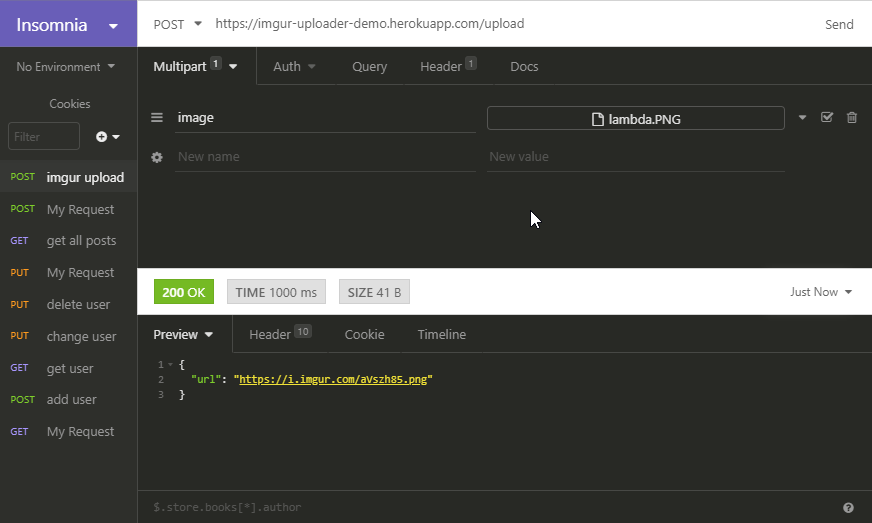

# imgur-endpoint

A nodejs endpoint for passing images imgur

orginally built for this project https://github.com/Build-Week-Bucket-List

## How To Use

it seem simlpy accepts an image and passes it to imgur, returning the resulting url

### Spinning Up Your Own Server

This application requires a few enviroment varialbles. 
  * `CLIENT_ID`: this is an imgur api client ID, you will have to request one from imgur
  * `CLIENT_DOMAIN`: this is the domain set in the cors header. For testing purposes you can set it to `*`

### Using My Deployment

A deployment already exists @ https://imgur-uploader-demo.herokuapp.com/


### Example Usage:

Demo: https://imgur-uploader-demo.herokuapp.com/upload

#### HTML:


```html
<!DOCTYPE html>
<html lang="en">
<head>
    <meta charset="UTF-8">
    <meta name="viewport" content="width=device-width, initial-scale=1.0">
    <meta http-equiv="X-UA-Compatible" content="ie=edge">
    <title>Imgur uploader</title>
</head>
<body>
    <form action="https://imgur-uploader-demo.herokuapp.com/upload?html=true" method="POST" enctype="multipart/form-data">
        <input type="file" name="image" accept="image/*">
        <input type="submit">
    </form>
</body>
</html>
```

#### JS:

```html
<!DOCTYPE html>
<html lang="en">

<head>
    <meta charset="UTF-8">
    <meta name="viewport" content="width=device-width, initial-scale=1.0">
    <meta http-equiv="X-UA-Compatible" content="ie=edge">
    <script src="https://cdnjs.cloudflare.com/ajax/libs/axios/0.19.0/axios.min.js" ></script>
    <title>Imgur uploader</title>
</head>

<body>
    <form id="upload">
        <input type="file" name="image" accept="image/*">
        <input type="submit">
    </form>
    <script>
        const form = document.getElementById('upload')
        form.addEventListener('submit', (event) => {
            event.preventDefault()
            const data = new FormData()
            data.append('image', event.target.children[0].files[0])
            axios.post('https://imgur-uploader-demo.herokuapp.com/upload', data)
                .then(res => {
                    let image = document.createElement('IMG');
                    image.src = res.data.url;
                    document.body.appendChild(image);
                })
        })
    </script>
</body>

</html>
```

### REST CLIENT:

change the body type to multipart


create a value called image, and changes it's type to file


select an image to ujpload


send the request, the server will send back a json object containing a url. If you add `html=true` to the query you will get back an html image tag


